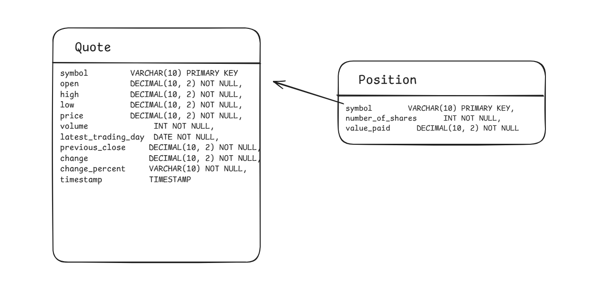

# Introduction

The Stock Quote App is a command-line tool that allows users to fetch real-time stock quotes, buy and sell stocks, and manage their stock portfolio. Developed in Java, it leverages JDBC for database interactions with PostgreSQL, OkHttp for HTTP requests to fetch stock data from the Alpha Vantage API, and SLF4J for logging. The app follows the DAO design pattern for data access and is built with Maven. It is packaged with Docker and can be easily deployed using Docker Compose, ensuring a consistent execution environment.

# Implementaiton

## ER Diagram

## Design Patterns

For this application the Data Access Object (DAO) and Repository design patterns are crucial for managing data access in a clean and maintainable way. The DAO pattern abstracts and encapsulates all access to the data source, providing a consistent tool for CRUD operations. This allows the codebase to be easier to maintain and test. Specifically we use the QuoteDao and PositionDao classe which implements the DAO pattern, handling interactions with the PostgreSQL database.

The Repository pattern acts as a storage for objects in memory, providing a more object-oriented way to handle data. It offers a higher-level abstraction over the DAO pattern, focusing on business logic and specific operations. In the Stock Quote App, the QuoteService and PositionService classes implement the Repository pattern, using DAOs to interact with the database while providing business logic for managing quotes and positions.

# Test

To test the Stock Quote App against the PostgreSQL database, you can use the following:

1. Setup PostgreSQL Database:
   Ensure that PostgreSQL is installed and running on your machine or in a Docker container. Create a database named stock_quote and configure it according to the settings in the properties.txt file.

2. Run Maven Tests:
   The mvn clean test command will run he unit tests and integration tests defined in the project, verifying the application's functionality against the PostgreSQL database.

3. Self-Testing Using the Actual Application:
   After setting up the PostgreSQL database, you can also test the application manually by running it and performing various operations such as fetching stock quotes, buying stocks, and selling stocks.
