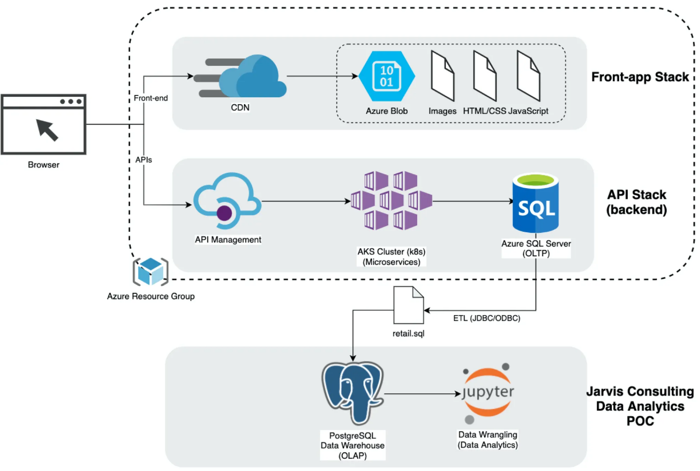

# Introduction

London Gift Shop (LGS) is an online e-commerce store specializing in gift-ware. This project includes the proof of concept (POC) created by data engineering consultants within Jarvis Consulting Group to help the LGS marketing team better understand their customer shopping patterns. All the analysis are presented within the Jupyter notebook, using Python + Pandas for dataframes and Matplotlib for graphing.

# Project Architecture

Due to POC security requirements, the Jarvis team isn't allowed to work directly with the LGS Azure environment. As a result, the LGS IT team, through their ETL process, provided transaction data through an SQL file for Data Wrangling/Analytics on our side.

# Data Analytics and Wrangling

The data analytics and wrangling process involved several key steps to transform and analyze the transaction data provided by the LGS IT team. The main focus was on understanding customer behavior and deriving insights that could help the LGS marketing team.

## Data Preparation

- The transaction data was loaded from a CSV file into a Pandas DataFrame.
- Data types were converted to appropriate formats, such as datetime for invoice dates and numeric types for quantities and prices.

## Exploratory Data Analysis (EDA)

- Histograms and other visualizations were created to understand the distribution of key variables.

## RFM Analysis

RFM (Recency, Frequency, Monetary) analysis was performed to segment customers based on their purchasing behavior. The RFM scores were then combined to create an overall RFM score for each customer, which helps in identifying high-value customers and tailoring marketing strategies accordingly. The customers were segmented into different categories such as:

- **Champions**: These are the most valuable customers who purchase frequently and spend the most. They are crucial for the business and should be rewarded to maintain their loyalty.
- **Potential Loyalists**: Customers who have shown interest and have the potential to become loyal customers. They should be nurtured with targeted marketing campaigns.
- **At Risk**: Customers who used to purchase frequently but have not made a purchase recently. They need to be re-engaged with special offers or reminders.

# Improvements

In the future, regression analysis can be applied to the RFM data to predict hypothetical scores for users. This approach can help understand how changes in customer behavior might affect their RFM scores and allow LGS to target specific groups of individuals more effectively. By leveraging predictive analytics, LGS can enhance their marketing strategies and improve customer retention.
